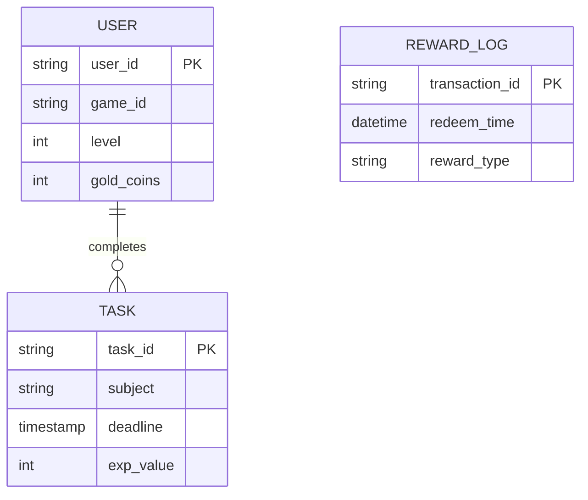

以下是为高中生设计的游戏化学习激励软件需求文档（含技术实现方案），采用模块化设计思路，可直接交付开发团队：

---

# **「Study Quest」游戏化学习系统需求文档**  
**版本**：v1.0  
**目标用户**：缺乏自制力的高中生（兼顾家长/教师管理端）  

---

## 一、核心功能架构
### 1. **玩家（学生）终端**
#### 1.1 任务系统
- **关卡地图**  
  - 可视化学科知识树（3D旋转模型）  
  - 章节转化为副本（数学函数→"函数城堡"）  
  - 动态难度评估（根据成绩自动调整题目难度）  

- **任务发布**  
  - 同步学校课表自动生成每日任务  
  - 支持教师端推送BOSS战（模拟考试）  

#### 1.2 奖励系统
- **虚拟经济**  
  - 1个番茄钟（25分钟）= 10金币（可兑换游戏时间）  
  - 连续学习7天解锁"毅力宝箱"  

- **装备商店**  
  - 金币兑换：  
    - 30金币 = 1小时游戏时间（需家长端批准）  
    - 100金币 = 自定义头像框  

#### 1.3 战斗系统
- **实时反馈**  
  - 答题时出现打击特效（正确=暴击数字）  
  - 错题本自动生成"怪物图鉴"（记录错误知识点）  

- **组队模式**  
  - 3人小组共同挑战题库（语音连麦功能）  
  - 排行榜分学科展示（隐藏真实姓名，显示游戏ID）  

### 2. **家长/教师管理端**
- **契约制定**  
  - 设置游戏时间兑换比例（如1:2/1:3）  
  - 查看学习时长热力图（精确到分钟级记录）  

- **成就审核**  
  - 审核特殊奖励发放（如实物奖励需家长确认）  
  - 接收系统预警（连续3天未完成任务时）  

---

## 二、技术实现方案
### 1. 数据架构


### 2. 关键算法
- **动态难度调整**  
  使用Elo评分算法计算题目难度：  
  ```
  新难度 = 旧难度 + K*(实际得分 - 预期得分)  
  K值根据用户历史表现动态调整
  ```

- **防沉迷机制**  
  基于强化学习的游戏时间控制：  
  ```python
  def get_game_time(reward_points):
      base_time = 30 * 60  # 基础30分钟
      bonus = reward_points * 0.1 * 60  # 每10点奖励1分钟
      return min(base_time + bonus, 120 * 60)  # 上限2小时
  ```

### 3. 交互设计
- **沉浸式学习场景**  
  - 选择题界面模拟RPG战斗场景（选项为技能按钮）  
  - 背诵课文时触发"咒语吟唱"语音识别  

- **中断管理**  
  - 突发退出时弹出"是否保存进度？"  
  - 超过5分钟无操作自动进入"挂机模式"（停止计时）  

### 4. 前后端技术栈
- **前端**  
  - **框架**：Vue 3 + Composition API + TypeScript 
  - **UI库**：Element UI（国内访问快）  
  - **游戏引擎**：PixiJS（轻量级2D渲染）  
  - **状态管理**：Pinia  
  - **动画**：VueUse/motion  
  - **打包工具**：Vite  

- **后端**  
  - **框架**：FastAPI  
  - **数据库**：Supabase中国版（PostgreSQL）  
  - **实时通信**：WebSocket (通过Starlette)  
  - **API文档**：自动生成Swagger UI  

### **基础设施**  
| 服务类型       | 选用方案                | 免费额度                |  
|----------------|-------------------------|------------------------|  
| **前端托管**   | Vercel（绑定备案域名）  | 100GB/月带宽           |  
| **后端托管**   | Deta Space              | 不限请求数             |  
| **数据库**     | Supabase中国区          | 500MB存储+1万行/天     |  
| **CDN加速**    | Cloudflare中国合作节点  | 基础加速免费           |  

---

## 三、运营指标
| 模块 | 监测指标 | 预警阈值 |
|-------|---------|----------|
| 任务系统 | 每日任务完成率 | <60%持续3天 |  
| 奖励系统 | 金币兑换游戏时间占比 | >70% |  
| 社交系统 | 组队学习平均时长 | <25分钟/次 |  

---

## 四、开发里程碑
1. **MVP版本（4周）**  
   - 基础任务/奖励系统  
   - 家长端契约设置  

2. **V1.2（8周）**  
   - 组队语音功能  
   - 与学校题库API对接  

3. **V2.0（12周）**  
   - AR实景学习（通过手机摄像头识别物理题）  
   - 脑电波专注度监测（需配合穿戴设备）  

---

**附录**：  
- 游戏音效库需求清单（需包含8-bit风格提示音）  
- 学科知识图谱示例（数学/物理/化学初始版本）  

该文档已预留API接口位置，可快速对接主流教育平台（如作业帮/小猿题库）。建议采用Unity引擎开发以保证跨平台兼容性（Windows/iOS/Android）。